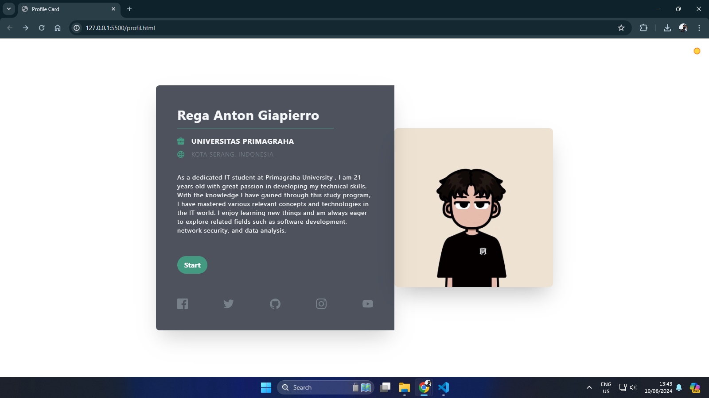

<p align="center"></p>

<h1 align="center">
   <a href="https://github.com/RegaAnton/Profil_Card.git" target="_blank" align="center">
      Profil Card
   </a>
</h1>

<p align="center">Menggunakan Bootstrap 5 sebagai Frontend</p>



## Installation ⚒️

Installing and running Sneat is super easy, please Follow below steps and you will be ready to rock 🤘

- Open the terminal in your root directory.

- Clone Project

```bash
git clone https://github.com/RegaAnton/Profil_Card
```

- Use the following command to install the composer

```bash
cd Profil_Card
```
